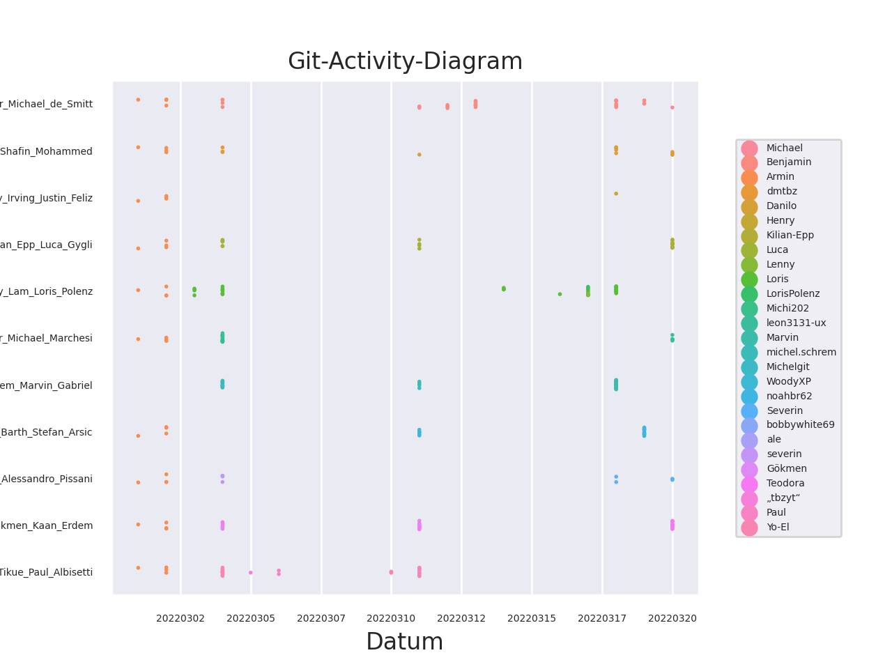

# Projektarbeit LB2

[[_TOC_]]

# Einleitung

Ihr Lehrer hat die Aufgabe, immer wieder GIT-Repos aller Schüler, bzw. aller Teams anzuschauen. 

Dabei wäre es nützlich, wenn er jeweils die Commits in allen Repos über die Zeit graphisch dargestellt hätte, sodass er gleich sieht welche Teams in den letzten Tagen Änderungen gemacht haben.

## Auftrag

Es sollen 2 Skripts erstellt werden. Das erste Skript soll alle GIT-Repos mit GIT-Kommandos klonen und in einen Verzeichnis ablegen.
Das zweite Skript soll von allen GIT-Repos in diesem Verzeichnis alle Commits auslesen und in einem File speichern.
Ihr Lehrer hat dann ein Skript, das diese graphisch dastellt. Das Resultat sieht dann ungefähr so aus:
     

### Skript 1: [git_clone_update_repos.bash](bin/git_clone_update_repos.bash)

Die Aufgaben des Skripts sind

* Auslesen eines Input Files in welchem die GIT-Urls und die Zielverzeichnisnamen gespeichert sind. Beispiel Format eines solchen Files:
```
https://gitlab.com/MDS160902/m122_praxisarbeit_desmitt_harlacher Benjamin_Harlacher_Michael_de_Smitt
git@github.com:dmtbz/m122_mitrovic_mohammed.git Danilo_Mitrovic_Mahbube_Shafin_Mohammed
git@gitlab.com:henry.irving2001/m122_praxisarbeit.git Henry_Irving_Justin_Feliz
https://gitlab.com/Kilian-Epp/m122_luca_kilian Kilian_Epp_Luca_Gygli
```
* Kommandline-Parameter für lokales Base-Verzeichnis soll eingelesen werden.
* Alle GIT-Repos sollen in ein zu definierendes lokales Base-Verzeichnis ins Zielverzeichnis geklont werden, falls das nicht schon geschehen ist. (`git clone URL <Base-Verzeichnis>/<Zielverzeichnis>`)
* Falls der GIT-Url schon geklont worden ist, soll nur ein git pull ausgeführt werden.

#### Muss-Kritierien
* Mehrere GIT-Repos müssen abgefragt werden können.
* Die GIT-Repo-URLs und ihre Zielverzeichnisse müssen in einem File als Liste übergeben werden können.
* Lokales Base-Verzeichnis soll als Kommandline-Parameter übergeben werden können.
* Es müssen alle geklonten Git-Repos die nicht mehr gebraucht werden (da sie nicht mehr im input file sind), gelöscht werden.
* Das Logging soll zentral implementiert werden. (D.h. es gibt eine log funktion die von beiden skripts gebraucht wird)
* Es soll ein zentrales Konfigurationsfile erstellt werden, das von beiden Skripts benutzt wird.
* Kommentare von allen wichtigen Programmabschnitten bzw. Funktionen.
* Saubere Fehlerbehandlung, wenn z.B. ein Verzeichnis bzw. File nicht existiert oder lesbar ist.

#### Kann-Kriterien
* Commando-Zeilen Option für Debugging ermöglichen.

### Skript 2: [git_extract_commits.bash](bin/git_extract_commits.bash)

Die Aufgaben des Skripts sind:

* Von allen GIT-Repos, die im Base-Verzeichnis sind, sollen alle Commits mit `git log ...` ausgelesen und in einem File gespeichert werden. 
* Die folgenden Infos der Commits sollen in diesem File gespeichert werden:
```
Zielverzeichnis,Datum,Commit-Hash,Author
Benjamin_Harlacher_Michael_de_Smitt,20220312,c0e1a034f3cf53a392d35850b42ad4a91e7a920c,Benjamin
...
...
Benjamin_Harlacher_Michael_de_Smitt,20220311,7fb40cbaacae6d9e1d598b030560117ccad28d63,Michael
Benjamin_Harlacher_Michael_de_Smitt,20220304,e7c290ccc48413244514151cee8c5a3ce7cf8b33,Benjamin
Benjamin_Harlacher_Michael_de_Smitt,20220304,e79e162d01c090ebf7aca0a06137890eb5e16187,Benjamin
Benjamin_Harlacher_Michael_de_Smitt,20220304,
...
...
Danilo_Mitrovic_Mahbube_Shafin_Mohammed,20220320,c3d334120e51b8695b7fd0c753aa5e4c6342cf18,Danilo
Danilo_Mitrovic_Mahbube_Shafin_Mohammed,20220318,7f16e148d6c9329d79c0ab15db711a3621671bde,dmtbz
Danilo_Mitrovic_Mahbube_Shafin_Mohammed,20220318,4fa4a52b0e6883b4bdad0ddee33f1fdca0bf78af,Danilo
...
...
```
Wichtige Details zum Output-Format:

* Das Zielverzeichnis ist der Verzeichnis-Name unterhalb vom Base-Verzeichnis.
* Die Titelzeile soll genauso aussehen  wie im Beispiel.
* Datum soll genau in der Form YYYYmmdd wobei YYYY=Jahr, mm=Monat, dd=Tag sein.
* Author soll einfach aus dem Git-Log übernommen werden.
* Der Commit-Hash kann auch direkt aus dem Git-Log

#### Muss-Kritierien
* Es sollen alle GIT-repos von einem lokalen Verzeichnis ausgelesen werden können.
* Lokales Verzeichnis soll per Parameter uebergeben werden koennen.
* Das Output-Fileformat muss genau der obigen Definition entsprechen.
* Der Output-Filename soll als Kommandline-Parameter übergeben werden können.
* Das Logging soll zentral implementiert werden. (D.h. es gibt eine log funktion die von beiden skripts gebraucht wird)
* Es soll ein zentrales Konfigurationsfile erstellt werden, das von beiden Skripts benutzt wird.
* Kommentare von allen wichtigen Programmabschnitten bzw. Funktionen.
* Saubere Fehlerbehandlung, wenn z.B. ein Verzeichnis bzw. File nicht existiert oder lesbar ist.

#### Kann-Kriterien
* Commando-Zeilen Option für Debugging ermöglichen.


## Vorgehen

| Task | Beschreibung | Modus | zu bearbeitende Dokumente |
| - | - | - | - |
| Definition von User Interface | Definieren sie welche Argumente sie den Skripte übergeben werden und dokumentieren sie dies. | Teamarbeit | [Projektdokumenation](docs/Projektdokumentation.md) |
| Activity Diagramm | Zeichnen sie für die beiden Skripts Activity-Diagramme und für den Gesamten Prozess | Teamarbeit |[Projektdokumenation](docs/Projektdokumentation.md) |
| Testfälle erstellen | Beschreiben sie die Testfälle um ihre Skripte zu testen | Teamarbeit |[Testprotokoll](docs/Testprotokoll.md) |
| Definition von Konfigurationdateien | Definieren sie Konfigurationsdateien die beide Skripte benutzen sollen und dokumentieren sie diese. Definieren sie soweit bekannt die Konfigurationsparameter. Erstellen sie erste Sample-Konfigfiles. | Teamarbeit | [Projektdokumenation](docs/Projektdokumentation.md)<br>[Verzeichnes für Konfigfiles](etc) |
| Implementieren | Schreiben sie je eines der beiden Skripte. Passen sie die Sample-Konfiguration Files an falls nötig | Einzelarbeit | [Verzeichnis für Skripts](bin)<br>[Verzeichnes für Konfigfiles](etc)|
| Installationsanleitung | Machen sie eine Anleitung für den Administrator (Installation und Konfiguration des Skripts), d.h. alles was initial einmal gemacht werden muss | Einzelarbeit | [Betriebsdokumenation](docs/Betriebsdokumentation.md) |
| Anwendungsanleitung | Machen sie eine Anleitung für den Administrator oder Benutzer des Skripts mit den wiederkehrenden Tasks | Einzelarbeit | [Betriebsdokumenation](docs/Betriebsdokumentation.md) |
| Testen | Testen sie das Skript ihreres Teammitglieds und füllen das Testprotokoll aus| Einzelarbeit | [Testprotokoll](docs/Testprotokoll.md) |
